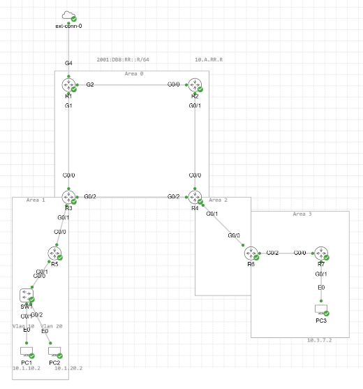

# Network Drift Detector

This project is a Python-based network automation tool designed to detect configuration and state drift across network devices by comparing structured snapshots over time.

This project was built and tested using a network lab environment in Cisco CML and is intended as a portfolio project demonstrating real-world network automation and operational thinking.

---

## Overview

Network devices change frequently due to maintenance, automation, or human error. This tool helps identify unintended or unexpected changes by:

- Comparing the two most recent snapshots per device
- Detecting logical configuration and state drift
- Classifying changes by severity
- Presenting results in a clean, human-readable format

---

## Requirements

- Python 3.9+  
- Git
- Network devices reachable via SSH (Cisco-based lab used during development)

## Setup
Clone the repository:

```bash
git clone https://github.com/RyanBeaudryTech/network-drift-detector.git
cd network-drift-detector
```

### Create a virtual environment

**Windows (PowerShell):**
```bash
python -m venv .venv
.venv\Scripts\activate
```

**macOS / Linux:**
```bash
python3 -m venv .venv
source .venv/bin/activate
```

### Install dependencies
```bash
pip install -r requirements.txt
```
## Conifguration
This project is designed to run against a Cisco-based lab environment. Configuration is handled through a small number of YAML and directory-based inputs that are included in the repository for transparency and ease of use.

Device connection details are defined in:
<pre>
config/devices.yml
</pre>

This file specifies the devices to poll and the connection parameters used by Scrapli. Because this project is intended for a lab environment, this file is included in the repository.

Example structure:

```yaml
devices:
- hostname: R1
  device_type: cisco_iosxe
  host: 10.0.0.1
  port: 22
  username: admin
  password: admin

- hostname: R2
  device_type: cisco_iosxe
  host: 10.0.0.2
  port: 22
  username: admin
  password: admin
```
You can modify this file to match your own lab topology or device credentials.

### Ignore Rules

Expected or noisy changes can be filtered using `ignore_rules.json`.  
Rules allow you to ignore specific paths or entire sections to reduce false positives.

## Features

- Snapshot-based comparison per device
- Structured JSON diffs instead of raw text comparison
- Supports:
  - Interfaces
  - Routing table
  - ARP table
- Severity classification:
  - HIGH (interface state changes)
  - MEDIUM (routing changes)
  - LOW (ARP changes)
- Diff results saved for auditing and review

---

## Lab Topology and Platform Assumptions

This project was developed and tested using a Cisco-based lab topology running IOS-style CLI output.
(the same topology used in the routing table collector project)

The lab represents a **multi-site OSPF environment**, where:

- Each “site” is an OSPF area
- **Area 3** does *not* directly connect to the backbone, so an **OSPF Virtual Link** is used through Area 2
- R1 serves as the **NAT Gateway** between CML and the home LAN
- All routers authenticate via **RADIUS** (FreeRADIUS running on an Ubuntu VM)

The topology includes:

- **7 Cisco routers** (R1–R7)
- **3 PCs** (Alpine Linux VMs inside CML)
- **Structured OSPF area design**
- **NAT + port-forwarding** for external SSH access
- **Centralized RADIUS authentication**

Platform Assumptions
- Device output is based on Cisco IOS-style commands, including:
  - show ip route
  - show arp
  - show ip interface brief
- Parsing logic is written specifically for Cisco-formatted CLI output
- Interface naming, route formatting, and status fields reflect IOS conventions

While the current implementation is Cisco-focused, the project is structured so that support for additional vendors or platforms could be added by introducing new parsers without changing the core diff engine.




## Project Structure
<pre>
network-drift-detector/
│
├── collector/
│   └── device_poller_v2.py
│
├── config/
│   └── devices.yml
│
├── diff_engine/
│   ├── snapshots/
│   ├── diff_utils_v2.py
│   ├── drift_detector_v2.py
│   └── ignore_rules.json
│
├── diffs/
├── README.md
</pre>

Description of Key Components

**collector/**  
Contains the polling logic responsible for connecting to network devices and collecting raw CLI output.
device_poller_v2.py retrieves state such as routing tables, ARP tables, and interface status, and saves snapshots for later comparison.

**config/**  
Holds configuration files used by the collector.
devices.yml defines the devices to poll, including connection parameters.

**diff_engine/**  
Core logic for detecting and presenting network drift.

**snapshots/**  
Stores timestamped JSON snapshots of device state.

**diffs/**  
Stores generated diff results for auditing and historical reference.

diff_utils_v2.py  
Contains parsing logic, structured diff generation, severity classification, and ignore-rule filtering.

drift_detector_v2.py  
Main entry point for comparing snapshots, grouping diffs by severity, and producing human-readable output.

ignore_rules.json  
Defines sections or paths of the data model that should be suppressed during drift detection.

---

## How It Works

1. **Snapshots are collected**  
   Device command output is stored as JSON snapshots, including routing tables, ARP tables, and interface state.

2. **Data is normalized**  
   Raw CLI output is parsed into structured dictionaries so changes are compared logically instead of line by line.

3. **Structured diffs are generated**  
   Changes are identified as added, removed, or modified.

4. **Severity is classified**  
   - Interface state changes are HIGH severity  
   - Routing changes are MEDIUM severity  
   - ARP changes are LOW severity  

5. **Results are displayed**  
   Output is grouped by severity and section, with interface changes collapsed into a single readable event.

---

## Example Output
<pre>
Comparing snapshots for R5:
Previous: 2025-12-18_16-44-46.json
Latest:   2025-12-18_16-46-29.json

🔥 Drift Detected!

[HIGH]
========================================

Interfaces
----------------------------------------
* GigabitEthernet0/1.20: admin up → down, oper up → down
* GigabitEthernet0/1: admin up → down, oper up → down
* GigabitEthernet0/1.10: admin up → down, oper up → down

[MEDIUM]
========================================

Routing
----------------------------------------
- C 10.1.10.0/24 is directly connected, GigabitEthernet0/1.10
- L 10.1.10.1/32 is directly connected, GigabitEthernet0/1.10
- L 10.1.20.1/32 is directly connected, GigabitEthernet0/1.20
- C 10.1.20.0/24 is directly connected, GigabitEthernet0/1.20

[LOW]
========================================

ARP
----------------------------------------
- ARP 5254.000b.90ad on GigabitEthernet0/1.20
- ARP 5254.000b.90ad on GigabitEthernet0/1.10

</pre>
---

## Testing in a Lab Environment

Recommended test scenarios:

- Shut and no shut an interface
- Add or remove a static route
- Clear ARP entries
- Change interface IP addressing
- Introduce known changes and suppress them using ignore rules

---

## Disclaimer

This project was built for learning and portfolio purposes and is not intended to replace enterprise configuration management systems.
